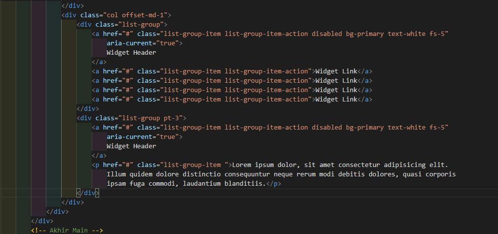
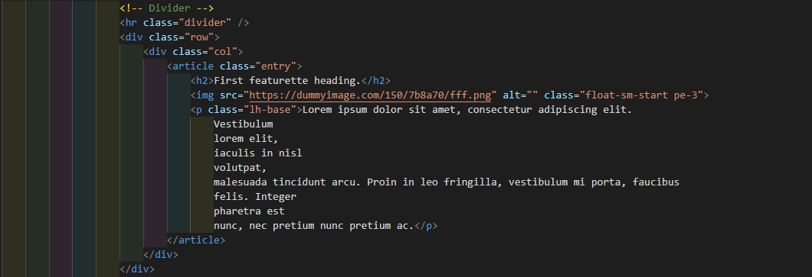
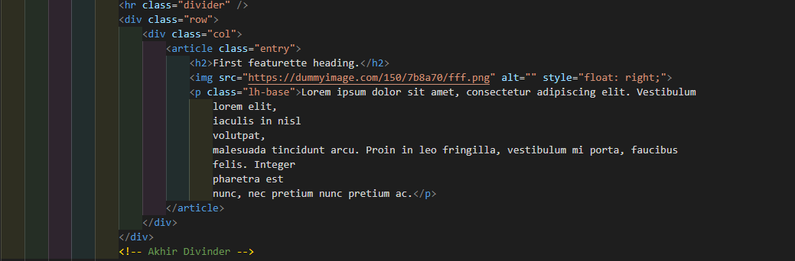
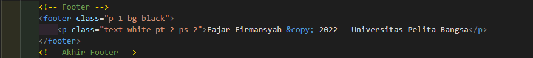

# Lab6Web

## css framework

1. Membuat CSS container

* Memasukan CSS class container di dalam Head, `container didapatkan di dalam body `

### Isi didalam Class Container

2. Membuat Header

3.  Membuat Navbar

4. Membuat Class Hero

5. Membuat Class Main

6. Membuat Class Divider

7. Membuat Footer

### Hasil Dari Program HTML

